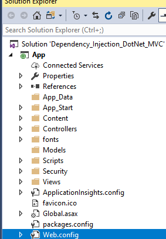
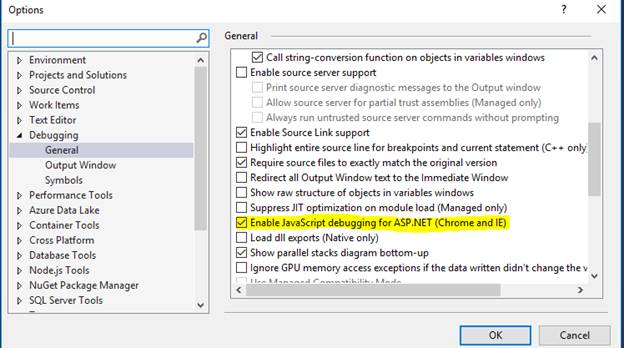
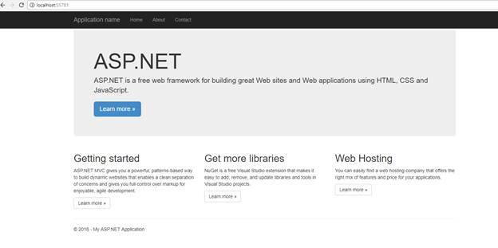
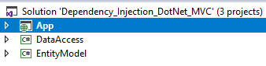
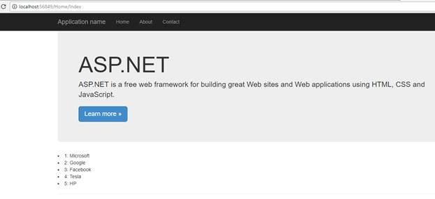

<html>

<head>
<meta http-equiv=Content-Type content="text/html; charset=windows-1252">
<meta name=Generator content="Microsoft Word 15 (filtered)">

</head>

<body lang=EN-US>

    <article class="markdown-body entry-content" itemprop="text"><h1><a id="user-content-ninject" class="anchor" aria-hidden="true" href="#ninject"><svg class="octicon octicon-link" viewBox="0 0 16 16" version="1.1" width="16" height="16" aria-hidden="true"><path fill-rule="evenodd" d="M4 9h1v1H4c-1.5 0-3-1.69-3-3.5S2.55 3 4 3h4c1.45 0 3 1.69 3 3.5 0 1.41-.91 2.72-2 3.25V8.59c.58-.45 1-1.27 1-2.09C10 5.22 8.98 4 8 4H4c-.98 0-2 1.22-2 2.5S3 9 4 9zm9-3h-1v1h1c1 0 2 1.22 2 2.5S13.98 12 13 12H9c-.98 0-2-1.22-2-2.5 0-.83.42-1.64 1-2.09V6.25c-1.09.53-2 1.84-2 3.25C6 11.31 7.55 13 9 13h4c1.45 0 3-1.69 3-3.5S14.5 6 13 6z"></path></svg></a>Simple Injector</h1>

Simple Injector is an easy-to-use Dependency Injection (DI) library for .NET 4+ that supports Silverlight, Windows Phone, Windows 8 including Universal apps and Mono. Simple Injector is easily integrated with frameworks such as Web API, MVC, WCF, ASP.NET Core and many others. It’s easy to implement the dependency injection pattern with loosely coupled components using Simple Injector.

<a href="https://simpleinjector.org/index.html">Read use of Simple Injector on offical website  </a>
  

<em>Step by step guide to implement sinple injector in MVC. Sample code is created in Visual studio 2017 community edition</em>

Steps:

&nbsp;

1.&nbsp;&nbsp;&nbsp;&nbsp;&nbsp;
Open visual
studio and create web application selecting MVC.

&nbsp;

&nbsp;

2.&nbsp;&nbsp;&nbsp;&nbsp;&nbsp;
Run the
application. while running application in visual studio 2017 community, you can
see below screen, if not jump to next step.

So wait until the application get loads, it was taking too much time so
you can disable it from tools-&gt;options-&gt;debugging and uncheck the item

&nbsp;

&nbsp;

3.&nbsp;&nbsp;&nbsp;&nbsp;&nbsp;
Once application
loaded you can see

&nbsp;

&nbsp;

4.&nbsp;&nbsp;&nbsp;&nbsp;&nbsp;
Install “SimpleInjector.Integration.Web.Mvc”  package from nugget, it will
install all dependencies. Packages.config file will have now entries 

&nbsp;

&lt;package id=&quot;SimpleInjector&quot; version=&quot;4.2.2&quot; targetFramework=&quot;net461&quot; /&gt;

&lt;package id=&quot;SimpleInjector.Integration.Web&quot; version=&quot;4.2.2&quot; targetFramework=&quot;net461&quot; /&gt;

&nbsp;

&lt;package id=&quot;SimpleInjector.Integration.Web.Mvc&quot; version=&quot;4.2.2&quot; targetFramework=&quot;net461&quot; /&gt;

&nbsp;

5.&nbsp;&nbsp;&nbsp;&nbsp;&nbsp;
Add two projects
“DataAccess” and “EntityModel”. Dataaccess is for interacting with database and
entity model will contains entities. Add references of these projects in “App”
project

&nbsp;

&nbsp;

6.&nbsp;&nbsp;&nbsp;&nbsp;&nbsp;
In DataAccess
layer, create one folder “Interface” and interface file “ICompanyRepository.cs”

&nbsp;

File contents:

namespace DataAccess.Interface

{

    public interface ICompanyRepository

    {

        List&lt;Company&gt;
GetCompanies();

    }

}

&nbsp;

Now, create “Repository” folder and add class file
“CompanySqlRepository.cs”. Implement interface and created the constructor to
inject IDbConnection which will return sqlconnection. 

To check IDbConnection, I am just going to open sql connection and
getting it close.

&nbsp;

Add your sql connection string in web.config file

&lt;add name=&quot;mssql&quot; connectionString=&quot;Data
Source=#DataSourceName#; Integrated Security=True;User ID=sa;
Password=#password#; Initial Catalog=#DatabaseName#;&quot;
/&gt;

&nbsp;

File contents:

using
System.Collections.Generic;

using System.Data;

using
DataAccess.Interface;

using
EntityModel.DomainModel;

using
System.Configuration;

&nbsp;

namespace
DataAccess.Repository.Dapper.MSSQL

{

    public class CompanySqlRepository : ICompanyRepository

    {

        private IDbConnection
_connection;

&nbsp;

        public
CompanySqlRepository(IDbConnection conn)

        {

           
_connection = conn;

           
_connection.ConnectionString = ConfigurationManager.ConnectionStrings[&quot;mssql&quot;].ConnectionString;

        }

&nbsp;

        public List&lt;Company&gt;
GetCompanies()

        {

            _connection.Open();

            _connection.Close();

&nbsp;

            var lstCompany = new
List&lt;Company&gt;()

            {

                new Company{Id=1, Name=&quot;Microsoft&quot; },

                new Company{Id=2, Name=&quot;Google&quot; },

                new Company{Id=3, Name=&quot;Facebook&quot; },

                new Company{Id=4, Name=&quot;Tesla&quot; },

                new Company{Id=5, Name=&quot;HP&quot; }

            };

&nbsp;

            return lstCompany;

        }

    }

}

7.&nbsp;&nbsp;&nbsp;&nbsp;&nbsp;
Create “ApplicationDependencyResolver.cs” file under App_start folder and add
namespace “using SimpleInjector;”. Mark class as static and will start
creating method which contains all dependencies related to project.

Here we are going to add dependencies for IDbConnection and
ICompanyRepository, before this it’s important to Register MVC Controllers and
Filter Providers.

&nbsp;

Code:

using
DataAccess.Interface;

using
DataAccess.Repository.Dapper.MSSQL;

using SimpleInjector;

using
System.Configuration;

using System.Data;

using
System.Data.SqlClient;

&nbsp;

namespace App.App_Start

{

    Public static class ApplicationDependencyResolver

    {

        public static void
RegisterApplicationDependencies(Container container)

        {

           
container.RegisterMvcControllers();

&nbsp;

           
container.RegisterMvcIntegratedFilterProvider();

&nbsp;

            container.Register&lt;ICompanyRepository,
CompanySqlRepository&gt;(Lifestyle.Scoped);

&nbsp;

            container.Register&lt;IDbConnection&gt;(() =&gt; new
SqlConnection(ConfigurationManager.ConnectionStrings[&quot;mssql&quot;].ConnectionString),
Lifestyle.Scoped);

        }

    }

}

&nbsp;

&nbsp;

8.&nbsp;&nbsp;&nbsp;&nbsp;&nbsp;
Next step to
initialize injector, create new file  “SimpleInjectorWebInitializer.cs” and mark class as static.  It is
must to define “DefaultScopedLifeStyle” else it will throw error.  If you want
to add comman dependencies throughout the application like logger or cache,
then register as singleton. I have created method for it. As of now it is
commented. Let’s focus on interface ICompanyRepository injection.

&nbsp;

File contents:

using SimpleInjector;

using
SimpleInjector.Integration.Web;

using System;

using System.Web.Mvc;

using
SimpleInjector.Integration.Web.Mvc;

&nbsp;

//add assembly
System.Runtime.Caching for it

using
System.Runtime.Caching;

using log4net;

&nbsp;

&nbsp;

namespace App.App_Start

{

    public static class SimpleInjectorWebInitializer

    {

&nbsp;

        public static void
InitilizeContainer(Action&lt;Container&gt; registerApplicationDependencies)

        {

            GetInitializeContainer(registerApplicationDependencies);

        }

&nbsp;

        public static Container
GetInitializeContainer(Action&lt;Container&gt; registerApplicationDependencies)

        {

            var container = new Container();

           
Initialize(container, registerApplicationDependencies);

            return container;

        }

&nbsp;

        private static void Initialize(Container
container, Action&lt;Container&gt; registerApplicationDependencies)

        {

           
container.Options.DefaultScopedLifestyle = new WebRequestLifestyle();

           
RegisterCommandDependencies(container);

           
registerApplicationDependencies.Invoke(container);

           
DependencyResolver.SetResolver(new SimpleInjectorDependencyResolver(container));

        }

&nbsp;

        /// &lt;summary&gt;

        /// This class is to
register commandepencies through out the application, like logger, cache

        /// &lt;/summary&gt;

        private static void
RegisterCommandDependencies(Container container)

        {

            //container.RegisterSingleton&lt;ObjectCache&gt;(MemoryCache.Default);

            //container.RegisterSingleton&lt;ILog&gt;(LogManager.GetLogger(&quot;&quot;));

        }

    }

}

&nbsp;

&nbsp;

9.&nbsp;&nbsp;&nbsp;&nbsp;&nbsp;
Final step to
call Initialize from Global.asax file

&nbsp;

protected void Application_Start()

        {

            AreaRegistration.RegisterAllAreas();

&nbsp;

            Action&lt;Container&gt; registerApplictionDependencies
= ApplicationDependencyResolver.RegisterApplicationDependencies;

           
SimpleInjectorWebInitializer.InitilizeContainer(registerApplictionDependencies);

&nbsp;

           
FilterConfig.RegisterGlobalFilters(GlobalFilters.Filters);

            RouteConfig.RegisterRoutes(RouteTable.Routes);

            BundleConfig.RegisterBundles(BundleTable.Bundles);

     }

&nbsp;

10.&nbsp;&nbsp;&nbsp;&nbsp;&nbsp;&nbsp;&nbsp;&nbsp;
Open
Index.cshtml in views folder and add following code to list companies name

&lt;div&gt;

    @foreach (var item in ViewBag.Companies)

    {

        &lt;li&gt;@item.Id: @item.Name&lt;/li&gt;

    }

&lt;/div&gt;

&nbsp;

11.&nbsp;&nbsp;&nbsp;&nbsp;&nbsp;&nbsp;&nbsp;&nbsp;
Run application and it will show
list of companies

</body>

</html>
